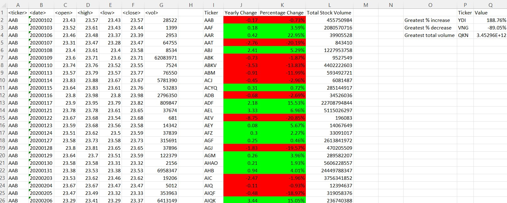

# StockStats Excel VBA Macro

## Overview
The VBA script analyzes stock market data stored in multiple worksheets within an Excel workbook. It performs calculations such as yearly change, percentage change, and total stock volume for each stock ticker. Additionally, it identifies the stocks with the greatest percentage increase, greatest percentage decrease, and greatest total volume. It iterates over all sheets in the Excel.

## Code Explanation
### Variables
* ws: Worksheet variable used to loop through each sheet in the workbook.
* lastRow: Long variable storing the last row of data in each sheet.
* summaryRow: Integer variable representing the row number in the summary tables.
* i: Long variable used as a counter for looping through rows.
* ticker, openPrice, closePrice, yearlyChange, percentageChange, totalVolume: Variables storing stock-related information.
* greatestIncreaseTicker, greatestDecreaseTicker, greatestVolumeTicker: Variables identifying stocks with the greatest increase, decrease, and volume.
* greatestIncrease, greatestDecrease, greatestVolume: Variables storing the corresponding values.

### Code Flow
1. Loop through Worksheets: The macro iterates through each worksheet in the workbook, assuming identical structures for all sheets.
2. Set Headers: Headers for two summary tables are set in each worksheet.
3. Initialize Variables: Variables for tracking the greatest increase, decrease, and volume are initialized.
4. Outer Loop (for all rows ona sheet): Iterates through rows on each sheet, focusing on one stock ticker at a time.
5. Inner Loop (for a ticker): For each ticker, it gets closing price and accumulates total volume
6. Calculate summary: yearly change, percentage change, and total volume, updating the summary table.
6. Format Cells: Colors cells in the summary table based on the values of yearly change and percentage change.
7. Check Greatest Values: Identifies stocks with the greatest percentage increase, decrease, and volume.
8. Fill Second Summary Table: Updates the second summary table with the identified greatest values.
9. Autofit Columns: Adjusts column widths for better visibility of data.

## Assumptions
* Data is assumed to be continuous on each sheet, and all columns have the same length.
* Data is sorted by ticker and date in ascending order.

## Performance Considerations
The code is optimized to iterate through each row only once, enhancing performance.

## Note
This macro assumes a specific data structure and sorting; modifications may be needed for different scenarios.